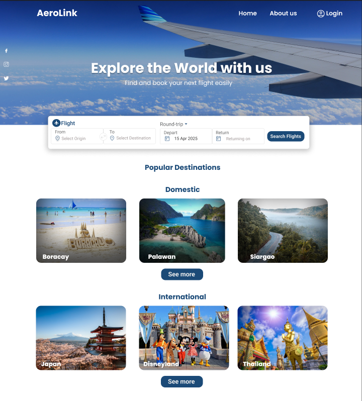
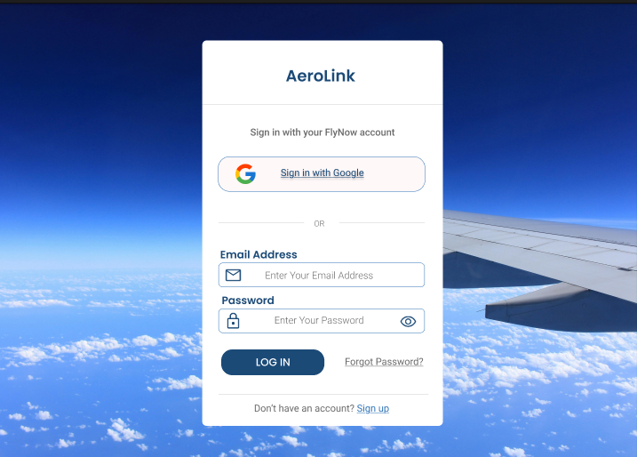
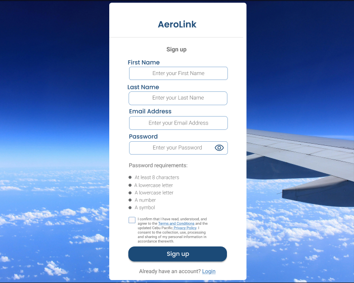
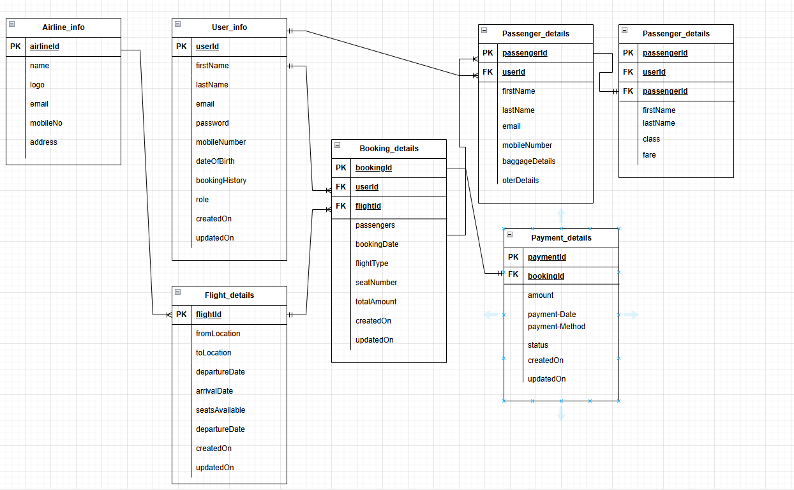

# 1. Title Page
- **Project Name**: AeroLink
- **Version**: 1.0
- **Date**: April 05, 2025
- **Author(s)**: [Gerald Narisma](https://www.linkedin.com/in/gerald-narisma-47041a216), [Kitz Saberon](https://www.linkedin.com/in/kitzsaberon), [John Michael Catapia](https://www.linkedin.com/in/john-michael-catapia-a62ba4238/)

# 2. Table of Contents
1. [Introduction](#3-introduction)
2. [Overall Description](#4-overall-description)
3. [Visual Mockup Reference](#5-visual-mockup-reference)
4. [Features](#6-features)
5. [Functional Requirements](#7-functional-requirements)
6. [Non-Functional Requirements](#8-non-functional-requirements)
7. [Data Requirements](#9-data-requirements)
8. [External Interface Requirements](#10-external-interface-requirements)
9. [Glossary](#11-glossary)
10. [Appendices](#12-appendices)

# 3. Introduction
- **Purpose**: Provide a seamless platform for users to search for, book, and manage airline flights, while also enabling airline administrators to manage flight offerings efficiently.

- **Scope**: The application will include features such as user registration and login, flight search and booking, payment processing, ticket generation, and administrative tools for managing flights. The first version will not include real-time flight tracking or integration with external airline APIs.

- **Definitions, Acronyms, and Abbreviations**:
  - **API**: Application Programming Interface – A set of rules that allows different software applications to communicate with each other.
  - **UI**: User Interface – The visual elements through which a user interacts with the system.
  - **UX**: User Experience – The overall experience and satisfaction a user derives from using the application.
  - **JWT**: JSON Web Token – A compact, URL-safe token used for securely transmitting information between parties, often for authentication.
  - **DB**: Database – An organized collection of structured information, typically stored electronically.
  - **CRUD**: Create, Read, Update, Delete – The four fundamental operations of persistent storage in software applications.
  - **HTML**: HyperText Markup Language – The standard language used to create and structure web content.
  - **CSS**: Cascading Style Sheets – A style sheet language used to describe the presentation of HTML content.
  - **JS**: JavaScript – A programming language used to create interactive effects within web browsers.
  - **NoSQL**: Not Only SQL – A type of database that provides a mechanism for storage and retrieval of data that is modeled in means other than the tabular relations used in relational databases.
  - **HTTPS**: HyperText Transfer Protocol Secure – A protocol for secure communication over a computer network, widely used on the Internet.
  - **ERD**: Entity-Relationship Diagram – A visual representation of different entities and their relationships, used in database design.

- **References**: None

# 4. Overall Description
- **Product Perspective**:  
  AeroLink is a full-featured, standalone web-based airline booking and management system designed to serve both passengers and airline administrators. The system functions as a centralized platform where end-users can seamlessly search for available flights, make reservations, process payments, and receive digital tickets. On the administrative side, airline staff can manage flight schedules, monitor bookings, and maintain airline-related data efficiently.

  The platform is built using a modern web technology stack (Node.js, Express, MongoDB, and a responsive front-end framework) and is intended to be scalable, secure, and user-friendly. While it is not dependent on third-party airline systems for flight data in its initial version, the system is designed with modularity in mind, allowing for future integration with external APIs and services such as real-time flight tracking and third-party airline databases.

- **Product Functions**: 
  - User registration and login
  - Flight search and booking
  - Ticket generation
  - Payment processing
  - Admin flight management

- **User Classes and Characteristics**: 
  - **End Users**: End Users are the general public or customers who utilize the airline booking application to plan and manage their air travel. Their interaction spans the full booking lifecycle, from account creation to receiving their flight ticket.
    - **Key Characteristics and Functionalities:**
      - **User Registration and Login:** End Users can create a personal account using an email address or other identity methods. They can securely log in to manage their bookings and profile information.
      - **Flight Search and Booking:** Users can search for flights by specifying origin, destination, travel dates, and passenger details. The system displays available flights, allowing users to select options based on schedule, pricing, and service class.
      - **Payment Processing:** Once a flight is selected, End Users can proceed to a secure checkout page to complete payment using credit/debit cards, e-wallets, or other integrated payment gateways.
      - **Ticket Generation:** Upon successful booking and payment, the system automatically generates an electronic ticket (e-ticket), which is sent to the user via email and/or made accessible within their account.
      - **Booking Management:** End Users can view upcoming and past bookings, download tickets, and—depending on airline policy—initiate changes or cancellations through the interface.
  - **Admin Users**: Admin Users are authorized personnel responsible for overseeing and maintaining the airline's operational data within the application. Their role ensures flight information is accurate, up to date, and ready for customer bookings.
    - **Key Characteristics and Functionalities:**
      - **Secure Login and Role-Based Access:** Admins log into the system using admin credentials, with access privileges restricted to administrative functions only.
      - **Admin Flight Management:** Admins can create, update, and remove flight records. This includes managing flight numbers, schedules (departure/arrival times), routes, available seat classes, pricing, and aircraft details.
      - **Booking Oversight (Optional):** Admins may have visibility into user bookings for support or audit purposes but do not directly participate in the booking process.
      - **Data Accuracy and Integrity:** Admin users are responsible for ensuring all published flight details are correct, thereby enabling accurate search results and successful bookings for End Users.

- **Operating Environment**: 
  - **Client**: Web browser (Chrome, Firefox, Edge)
  - **Server**: Node.js backend, MongoDB database

- **Assumptions and Dependencies**: 
  - Internet connection required
  - Compatible device (desktop/mobile)
  - Secure payment gateway integration

# 5. Visual Mockup Reference
- **Figma Design File**: [View in Figma](https://www.figma.com/design/0ZWd8EkaEx95eKK0quPxOv/Airline-Booking-App-Mockup?node-id=0-1&p=f&t=SRRvnENCSj218dp3-0)
- **Sample Landing Page**: 
- **Sample Login Page**: 
- **Sample Registration Page**: 

# 6. Features
- **User Registration and Login**: Users (travelers and admins) can register and log in securely.
- **Flight Search and Booking**: Users can search for available flights based on locations and dates, and make bookings.
- **Passenger Management**: Users can add passenger details (name, email, baggage info, etc.) during booking.
- **Booking History**: Users can view a list of their current and past flight bookings.
- **Admin Dashboard**: Admins can manage airline details, flights, and monitor overall booking activity.
- **Payment Gateway Integration**: Users can securely make payments for their bookings via a payment gateway.
- **Ticket Generation**: The system generates digital tickets after a successful booking and payment.
- **Email Notifications**: Users receive email confirmations for successful bookings and payments.
- **Responsive Interface**: The application is designed to be mobile-friendly and accessible on all devices.
- **Role-Based Access Control**: Different access levels are provided for users and admins to ensure secure operations.

# 7. Functional Requirements

### Use Cases

#### Use Case 1: User Registration
- **Title**: Register a new user
- **Description**: Users can create an account with an email and password.
- **Actors**: End User
- **Preconditions**: User is on the registration page.
- **Postconditions**: User account is created and user is logged in.
- **Main Flow**: 
  1. User enters email and password.
  2. User clicks "Register".
  3. System creates the account and logs in the user.
- **Alternate Flows**:
  1. If the user enters an invalid email, the system shows an error message.
  2. If the user’s email is already registered, the system shows an error message.

#### Use Case 2: User Login
- **Title**: User login process
- **Description**: Users can log into their accounts using their email and password.
- **Actors**: End User
- **Preconditions**: User has already registered and is on the login page.
- **Postconditions**: User is logged in and redirected to the homepage or dashboard.
- **Main Flow**:
  1. User enters email and password.
  2. User clicks "Login".
  3. System validates credentials and logs in the user.
  4. System redirects the user to the homepage or dashboard.
- **Alternate Flows**:
  1. If the user enters invalid credentials, the system shows an error message.
  2. If the account is locked or inactive, the system shows an appropriate message.

#### Use Case 3: Flight Search and Booking
- **Title**: Search and book flights
- **Description**: Users can search for available flights based on departure and arrival locations, dates, and other criteria, and proceed to book the flight.
- **Actors**: End User
- **Preconditions**: User is logged into the system.
- **Postconditions**: User has successfully booked a flight.
- **Main Flow**:
  1. User enters departure and arrival locations and dates.
  2. User clicks "Search Flights".
  3. System displays available flights based on the search criteria.
  4. User selects a flight and clicks "Book Now".
  5. System prompts the user to enter passenger details and proceed with payment.
  6. User enters details and clicks "Proceed to Payment".
  7. User completes the payment and receives a digital ticket.
- **Alternate Flows**:
  1. If no flights match the criteria, the system shows a "No flights available" message.
  2. If payment fails, the system shows an error message and the booking is not confirmed.

#### Use Case 4: Admin Flight Management
- **Title**: Manage flight schedules
- **Description**: Admin users can add, update, and remove flight schedules in the system.
- **Actors**: Admin User
- **Preconditions**: Admin is logged into the system.
- **Postconditions**: Flight schedule data is updated.
- **Main Flow**:
  1. Admin accesses the "Flight Management" section of the admin dashboard.
  2. Admin can add new flight schedules, update existing ones, or remove flights.
  3. System validates the inputs (flight details, date, etc.) and saves the changes.
  4. System shows a confirmation message upon successful update.
- **Alternate Flows**:
  1. If there is an error in the input (e.g., invalid date), the system shows an error message and asks the admin to correct the input.
   - **Error Handling**: System will handle missing or incorrect data by providing clear error messages.

# 8. Non-Functional Requirements
- **Security**:
  - Use HTTPS for all communications.
  - User passwords are hashed using bcrypt.
  - Implement proper session management to ensure user security.

- **Performance**:
  - The system should handle at least 1,000 concurrent users.
  - Average response time for booking a flight should be under 3 seconds.

- **Scalability**:
  - The system should be designed to handle increasing traffic and additional features in future versions (e.g., real-time flight tracking).

# 9. Data Requirements
- **Data Models**: 
  - User data: name, email, password hash, roles.
  - Flight data: flight ID, departure and arrival locations, date, time, capacity.
  - Booking data: booking ID, user ID, flight ID, passenger details.

## Entity Relationship Diagram (ERD)

# 10. External Interface Requirements
- **Web Interface**:
  - The system should be accessed via any modern web browser.
  - Responsive design to support both desktop and mobile devices.

# 11. Glossary
- **API**: A set of routines, protocols, and tools for building software applications.
- **CRUD**: The four basic operations on databases: Create, Read, Update, Delete.

# 12. Appendices
- **Appendix A**: ER Diagram  
- **Appendix B**: API Endpoints  
- **Appendix C**: Use Case Diagram  
- **Appendix D**: Flight Booking Flowchart  
- **Appendix E**: [Trello Development Board](https://trello.com/invite/b/681331ce79a4e5bfea2e52d9/ATTIa592823d6077de2d470a53ecb6a5103dD95D4541/mcp-sideproject-airlinebooking-dev-board)

